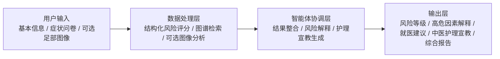

# 基于公共数据与知识图谱的糖尿病足风险提示与中医护理宣教智能体

原始长题目：基于公共多模态数据与知识图谱的糖尿病足风险评估与中医外治辅助管理智能体

这是一个面向课程展示和后续扩展的项目骨架，目标不是一次性做成“大而全”的临床系统，而是基于公开可获得的数据与指南知识，完成一个主线清晰、可运行、可解释、便于答辩展示的原型系统。

## 项目定位

一句话概括：

`面向糖尿病患者居家足部健康管理与基层风险提示辅助场景的智能原型系统`

当前版本的核心定位是：

- 以公开结构化数据支撑糖尿病足相关高危因素识别与风险提示原型。
- 以知识图谱支撑足部护理、就医时机和中医护理宣教问答。
- 以 Streamlit 提供网页化交互和综合报告展示。
- 将图像模块和硬件模块作为扩展能力，而不是当前版本的唯一主验证目标。

## 范围收口

为了保证课程项目能稳妥完成，当前方案采用“1 个主线 + 2 个扩展”的收口方式。

### 主线功能

- NHANES 结构化风险评估原型
- 知识图谱问答
- Streamlit 网页
- 综合报告生成

### 扩展 1

- DFUC 足溃疡图像演示模块（首选图像扩展路线）
- 支持本地样本扫描、样本预览、训练面板和 checkpoint 推理

### 扩展 2

- 热成像与传感器接口预留（保留为扩展说明）

这样的拆分可以保证答辩时逻辑清楚：

“我们先把主流程跑通，再保留多模态与硬件扩展能力。”

## 主线任务定义

当前版本主线并不直接进行糖尿病足临床确诊预测，而是将“糖尿病足风险提示辅助”具体落到：

`基于周围神经病变相关变量、下肢血供相关指标及既往病史构建综合风险分层规则/模型`

因此，当前主线输出的核心结果是：

- 综合风险等级
- 高危因素解释
- 就医建议
- 护理宣教建议

这一定义可以更好地对应 NHANES 可获得的结构化变量，也更适合当前课程项目的实现深度。

## 项目目标

- 用公开结构化数据支撑糖尿病足相关风险提示与高危因素解释
- 用知识图谱支撑指南化问答与证据溯源
- 用 Streamlit 提供网页化交互与报告生成
- 将中医模块定位为护理宣教、知识辅助与居家管理建议
- 为后续图像、多模态和硬件扩展预留统一接口

## 系统总流程



## 需求分析

### 1. 项目背景

糖尿病足及其相关并发症具有明显的早筛和管理需求，但在居家场景和基层慢病管理场景中，患者往往缺乏足够的风险识别能力，也缺少一个可以同时整合问卷信息、知识解释和健康教育建议的轻量化工具。

从课程项目的实现角度看，这个方向具备几个现实优势：

- 公开结构化数据可支撑风险评估任务。
- 足部图像与热成像资源可以作为多模态扩展展示。
- 指南、教育资料和综述相对丰富，适合构建知识图谱与问答原型。
- 中医内容可以自然落到护理宣教和居家管理辅助，而不必声称做中医疗效建模。

因此，这个项目更适合作为“公共数据 + 知识图谱 + 网页智能体”的课程原型，而不是一个宣称完成全链路临床验证的系统。

### 2. 应用场景

本项目面向的核心场景是：

`糖尿病患者居家足部健康管理与基层风险提示辅助`

可覆盖以下使用环境：

- 糖尿病患者在家中进行日常足部自查和风险提示。
- 社区卫生服务中心或基层慢病随访中的快速初筛。
- 存在足麻、刺痛、感觉减退、疼痛等症状人群的辅助评估。
- 课程答辩中展示多源数据、知识图谱与智能体网页的系统整合能力。

### 3. 目标用户

- 糖尿病患者：需要更直观的足部风险提示和日常护理建议。
- 高风险人群：如病程较长、血糖控制欠佳、既往足溃疡史或感觉异常者。
- 基层医护和慢病管理人员：需要一个轻量化、可解释的辅助工具。
- 课程评审者：需要看到一个范围合理、闭环完整、能跑起来的项目原型。

### 4. 核心痛点确认与项目对应解决

**核心痛点：**

在居家与基层慢病管理场景中，糖尿病患者足部高危风险缺乏一个低门槛、可解释、可操作的早期风险提示与护理宣教入口。

**具体表现：**

- 足部问题早期可能不明显，患者容易延迟识别。
- 患者难以根据自身症状、病程和既往病史判断是否属于高风险。
- 足部护理、就医时机和中医护理宣教知识分散，缺乏统一、结构化的获取方式。

**项目对应解决：**

本项目通过公开结构化数据实现糖尿病足相关高危因素识别与综合风险分层，通过知识图谱提供足部护理、就医时机和中医护理宣教建议，并通过网页原型形成一个面向居家与基层场景的轻量化风险提示与健康教育入口。

**项目可解决的范围：**

- 解决“用户不知道自己是否属于高风险”的问题。
- 解决“用户不知道什么时候该尽快就医”的问题。
- 解决“护理宣教知识分散、难以获取”的问题。

**项目不解决的范围：**

- 不直接进行糖尿病足临床确诊。
- 不替代医生检查、诊断和治疗决策。
- 不进行中医疗效建模或个体化治疗推荐。

### 5. 建设目标

本项目不是构建临床诊断软件，而是构建一个适合课程展示和后续迭代的原型平台，目标包括：

- 形成一套面向糖尿病足风险提示的多源异构数据资源组织方案。
- 构建一个可支撑问答与证据展示的知识图谱原型。
- 构建一个包含风险问卷、知识问答和综合报告的网页应用。
- 为图像分析和传感器输入保留扩展接口。
- 形成一个“数据可得、流程可讲、结果可解释、演示可完成”的课程闭环。

### 6. 功能需求

#### 6.1 风险评估需求

当前主线任务并非直接进行糖尿病足临床确诊预测，而是基于公开结构化变量完成糖尿病足相关高危因素识别与综合风险分层。

- 输入年龄、性别、糖尿病病程、HbA1c 等基础信息。
- 输入足麻、刺痛、疼痛、感觉减退等症状信息。
- 输入既往足溃疡史、感染史、吸烟情况等高危因素。
- 输出低风险、中风险、高风险分层结果。
- 输出主要风险因子解释，而不是只给出一个分数。
- 输出对应的就医建议和居家管理建议。

#### 6.2 知识图谱问答需求

- 支持对糖尿病足、周围神经病变、足部护理、就医时机等问题进行问答。
- 支持中医护理宣教相关问答，如足部护理、轻柔推拿、穴位按压和生活调摄。
- 问答结果尽量附带证据来源或指南依据。
- 输出内容以结构化建议为主，而不是纯聊天式回复。
- 如存在破损、溃疡、感染或明显红肿热痛，应优先提示线下就医，而不是自行局部处理。

#### 6.3 图像扩展需求

- 支持上传手机拍摄的足部 RGB 图像。
- 为热成像图像输入预留接口。
- 对图像做演示版异常提示，如偏红区域、热点、明暗异常等。
- 将图像结果作为扩展演示，与主线风险评估分开表述。
- 明确图像分析仅用于辅助提示，不作为诊断依据。

#### 6.4 综合报告需求

- 汇总用户基本信息和主要风险因素。
- 汇总风险等级和建议就医级别。
- 汇总知识图谱问答内容。
- 如已使用图像模块，汇总图像提示信息。
- 明确系统边界和免责声明。

### 7. 非功能需求

#### 7.1 可实现性

- 优先选择公开数据和轻量级技术栈，保证学期内能落地。
- 前端采用 Streamlit，降低开发和演示成本。
- 风险评估和问答模块优先完成；图像与硬件模块按扩展处理。

#### 7.2 可解释性

- 风险评估结果必须说明原因。
- 知识问答应尽量展示证据来源、知识节点或指南依据。
- 图像模块应输出可读的提示语，而不是纯黑盒分数。

#### 7.3 可扩展性

- 数据层要能继续接入 NHANES、DFUC 以及热成像研究数据。
- 图谱层要能升级到 Neo4j 等图数据库。
- 问答层要能扩展到 RAG、向量检索和大模型。
- 报告层要能扩展到 PDF 导出和历史记录管理。

#### 7.4 易演示性

- 系统页面结构清晰，便于答辩时快速切换。
- 每个模块都有明确输入和输出，便于截图和 PPT 展示。
- 所有核心结果尽量结构化，便于老师理解项目价值。

### 8. 数据需求

本项目采用的是：

`多源异构数据资源库 + 统一字段 schema + 分任务 benchmark`

而不是“同一批患者、同一协议、同一标签体系下的 patient-level 统一大数据集”。

这是本项目需要明确说明的关键边界，因为 NHANES、DFUC 和热成像研究数据并不是同一批对象、同一采集协议，也不能直接拼成单一患者级总表。

#### 8.1 结构化临床数据

用于支撑风险评估，包括：

- 人口学信息
- 糖尿病病程和控制情况
- 周围神经病变相关变量
- ABI 或下肢血供相关指标
- 足部并发症相关病史

#### 8.2 图像与多模态数据

用于支撑扩展演示，包括：

- 足部 RGB 图像
- 足底热成像图
- 图像标签或分割掩膜
- 采集模态和样本来源信息

#### 8.3 知识文本数据

用于支撑知识图谱与问答，包括：

- 糖尿病足指南
- 足部护理建议
- 神经病变相关教育资料
- 中医护理宣教知识
- 文献或综述中的风险因子和管理建议

### 9. 项目边界与限制

- 这是一个课程原型系统，不是临床诊断软件。
- 当前版本重点在于验证系统流程和交互闭环，不宣称医学诊断准确率。
- 图像分析模块当前为扩展演示能力，后续才适合替换为真实训练模型。
- 中医模块定位为护理宣教、知识辅助和居家管理建议，不做中医疗效建模。
- 所有高风险提示最终都应指向“建议线下就医或专科评估”。
- 如存在足部破损、溃疡、感染或明显红肿热痛，不建议自行进行局部按压或推拿。

### 10. 预期价值

- 对患者：提高足部自查意识，增强早期风险识别能力。
- 对基层场景：提供轻量化、可解释的初筛辅助工具。
- 对课程展示：体现公开数据、知识图谱、智能体和网页系统的整合能力。
- 对后续开发：为模型替换、图数据库接入和报告增强提供清晰基础。

## 评估指标

当前项目虽然以原型为主，但仍需要有基本评估闭环，避免只展示页面而无法说明效果。

### V1 原型阶段

- 风险分层规则覆盖率
- 高危因素解释完整度
- 问答命中率
- 证据引用覆盖率
- 页面响应时间
- 单次报告生成时间
- 人工检查一致性

### V2 模型阶段

- 结构化风险评估：AUC、F1、Recall、Calibration、特征重要性解释
- 图像模块分割任务：Dice、IoU
- 图像模块分类任务：Accuracy、AUC、Recall
- 知识问答模块：结构化完整度、证据覆盖率、人工一致性
- 系统层：响应时间、报告生成时间、结果可解释性展示完整度

## 数据资源与接入策略

本项目强调的是“高质量数据资源组织”，不是把所有来源强行拼成一个患者级统一总表。

更准确的表述应该是：

`多源异构数据资源库 + 统一字段 schema + 分任务 benchmark + 证据图谱`

### 数据来源表

| 数据名称 | 来源 | 主要任务 | 标签/粒度 | 是否公开 | 使用限制 | 当前定位 |
| --- | --- | --- | --- | --- | --- | --- |
| NHANES 2003-2004 等 | CDC/NCHS | 结构化风险评估 | 人群级结构化变量 | 是 | 需遵循 NHANES 数据使用规则 | 主线已规划 |
| DFUC Challenge 数据 | DFUC 挑战/论文 | 足溃疡分割 | 图像级掩膜标签 | 受限公开 | 需按许可协议申请 | 扩展演示 |
| STANDUP/相关热成像研究数据 | 研究论文与研究数据集 | 热特征分析/分类研究 | 热成像与 RGB 样本 | 研究型公开或有限开放 | 预处理流程较特定，需单独适配 | 预留扩展 |
| IDF/CDC/ADA/综述资料 | 指南与公开资料 | 知识图谱、问答、宣教 | 文本证据级 | 大多可公开访问 | 需规范引用 | 主线已规划 |
| 中医护理与外治知识 | 教材、综述、规范性资料 | 宣教与辅助建议 | 知识条目级 | 视来源而定 | 需人工筛选与规范表述 | 主线已规划 |

### 数据接入原则

1. 主线优先接入 NHANES 结构化数据，先完成风险评估原型。
2. 图像数据按任务单独处理，不与 NHANES 做 patient-level 直接融合。
3. 知识文本采用实体、关系、证据三层结构组织。
4. 所有多源数据通过统一字段 schema 和任务接口组织，而不是强行拼成同一总表。

## 数据落地件

为了让“高质量数据资源组织”不只停留在概念层，当前仓库补充以下落地文件：

- `data/data_cards.md`：记录各数据源的数据卡信息，包括来源、任务、粒度、使用限制和当前用途。
- `data/schema/field_mapping.csv`：记录统一字段与中文含义、任务模块和来源字段示例的映射关系。
- `data/schema/dataset_schema.yaml`：统一 schema 设计。
- `data/schema/knowledge_graph_seed.json`：知识图谱种子关系。

## 硬件与部署

老师要求中如果涉及“传感器、算力硬件”，建议分成“当前版本”和“升级版本”两层表述。

### 当前版本

- 手机 RGB 摄像头
- 普通笔记本或台式机
- Python + Streamlit
- CPU 即可运行主线演示

### 升级版本

- 手机外接热成像模块
- 足底压力垫或智能鞋垫
- 本地 GPU 或云端推理服务
- 边缘端部署设备

当前仓库并不要求必须具备热成像设备或压力传感器，硬件模块属于后续扩展方向。

## 当前项目包含什么

- `docs/project_framework.md`：完整项目框架与汇报逻辑
- `docs/ppt_outline.md`：可直接改成 PPT 的页级结构
- `docs/data_acquisition_guide.md`：数据获取与网页入口说明
- `docs/project_plan.md`：MVP 项目计划
- `data/data_cards.md`：各数据源的数据卡
- `data/schema/field_mapping.csv`：统一字段映射表
- `data/schema/dataset_schema.yaml`：异构数据统一字段设计
- `data/schema/knowledge_graph_seed.json`：知识图谱种子三元组
- `data/raw/nhanes/`：已下载的 NHANES 主线原始文件
- `data/raw/dfuc/`：DFUC 图像扩展数据预留目录
- `data/processed/nhanes_risk_base.csv`：第一版 NHANES 风险底表
- `data/processed/dfuc_image_index.csv`：DFUC 本地图像索引（放入图像后可生成）
- `artifacts/dfuc_baseline/`：DFUC 训练产物目录（训练元数据与 checkpoint）
- `app/streamlit_app.py`：可直接运行的网页原型
- `scripts/fetch_nhanes.sh`：NHANES 下载脚本
- `scripts/fetch_nhanes.ps1`：Windows PowerShell 下的 NHANES 下载脚本
- `scripts/prepare_dfuc_index.py`：DFUC 本地样本索引生成脚本
- `scripts/train_dfuc_baseline.py`：DFUC 最小训练脚手架
- `scripts/predict_dfuc_baseline.py`：DFUC 单图推理脚手架
- `scripts/prepare_nhanes.py`：NHANES 合并与底表生成脚本
- `scripts/prepare_nhanes_features.py`：NHANES 参考特征表生成脚本
- `src/diabetic_foot_agent/`：风险评估、图像分析、知识问答、报告生成代码
- `tests/`：基础单元测试

## 建议目录结构

```text
diabetic_foot_agent/
├── app/
│   └── streamlit_app.py
├── data/
│   ├── README.md
│   └── schema/
│       ├── dataset_schema.yaml
│       └── knowledge_graph_seed.json
├── docs/
│   ├── project_framework.md
│   └── ppt_outline.md
├── src/
│   └── diabetic_foot_agent/
│       ├── __init__.py
│       ├── image_analysis.py
│       ├── knowledge_graph.py
│       ├── models.py
│       ├── reporting.py
│       └── risk_assessment.py
├── tests/
│   └── test_core.py
├── pyproject.toml
└── requirements.txt
```

## 快速开始

### Windows PowerShell

```powershell
python -m venv .venv
.venv\Scripts\Activate.ps1
pip install -r requirements.txt
python -m pytest -q
streamlit run app/streamlit_app.py
```

如需一键重建当前电脑上的运行环境，可直接执行：

```powershell
powershell -ExecutionPolicy Bypass -File scripts/rebuild_env.ps1
```

如需在 Windows 下重新下载主线 NHANES 原始文件，可执行：

```powershell
powershell -ExecutionPolicy Bypass -File scripts/fetch_nhanes.ps1 -Force
python scripts/prepare_nhanes.py
python scripts/prepare_nhanes_features.py
```

如需启用 DFUC 的最小训练/推理脚手架，可额外安装视觉依赖：

```powershell
pip install .[vision]
python scripts/prepare_dfuc_index.py
python scripts/train_dfuc_baseline.py
python scripts/predict_dfuc_baseline.py <image_path> <weights_path>
```

训练完成后会在 `artifacts/dfuc_baseline/` 下生成：

- `checkpoints/best.pt`：最佳验证损失对应的 checkpoint
- `checkpoints/last.pt`：最后一轮 checkpoint
- `dfuc_baseline.json`：训练元数据，包含 `train/val loss`、`IoU`、`Dice` 等指标历史

此后重新打开 Streamlit 页面，`DFUC 数据入口` 会自动显示：

- 本地 DFUC 样本统计与预览
- 训练样本数、验证样本数、最佳验证损失
- `train/val loss` 曲线
- `train/val IoU` 与 `train/val Dice` 曲线
- 基于 `best.pt` 的本地分割推理按钮

建议的 DFUC 最小流程如下：

```powershell
pip install .[vision]
python scripts/prepare_dfuc_index.py
python scripts/train_dfuc_baseline.py
streamlit run app/streamlit_app.py
```

### macOS / Linux

```bash
python3 -m venv .venv
source .venv/bin/activate
pip install -r requirements.txt
python -m pytest -q
streamlit run app/streamlit_app.py
```

## 数据接入说明

- NHANES：可从 CDC/NCHS 官方页面获取公开数据与文档。当前主线优先考虑 2003-2004 周期中与下肢疾病相关的 `Lower Extremity Disease - Peripheral Neuropathy` 和 `Lower Extremity Disease - Ankle Brachial Blood Pressure Index` 等模块。
- DFUC：属于按许可协议申请的数据。挑战报告中公开描述了训练集和测试集各 2000 张图像及对应分割任务，因此当前 README 仅将其作为扩展图像模块来源，而不把它写成主线早筛数据底盘。
- 热成像研究数据：当前以研究型数据和文献流程为主，作为接口预留和扩展方向。
- 指南与宣教知识：主要用于构建知识图谱和问答原型。

## 当前原型的能力边界

- 风险评估模块目前是规则驱动原型，便于先跑通课程演示。
- 图像模块当前分为两层：默认启发式分析演示，以及可选的 DFUC 分割 baseline。
- DFUC baseline 已支持 `BCE + Dice loss`、训练/验证划分、`IoU`/`Dice` 指标统计和 checkpoint 推理，但仍属于课程项目 baseline，不代表可直接用于临床。
- 知识问答目前基于种子图谱与关键词检索，后续可接向量检索或 LLM。
- 报告模块强调“风险提示与健康教育”，不输出诊断性结论。

## 免责声明

- 本系统仅用于课程项目展示、风险提示和健康教育，不替代医生检查、诊断或治疗决策。
- 如出现足部破损、溃疡、明显红肿、渗液、感染或快速加重的不适，应及时线下就医。
- 中医相关输出仅限护理宣教、知识辅助和居家管理建议，不构成个体化治疗方案。
- 如存在足部破损、溃疡、感染或明显红肿热痛，不建议自行进行局部按压或推拿。

## 工作建议

- A：需求分析、文献整理、知识图谱构建
- ：数据清洗、风险评估模块、数据 schema 设计
- ：Streamlit 网页、智能体整合、汇报与演示

## 后续优先扩展建议

1. 接入 NHANES 清洗后的结构化特征表，替换规则评分为真实模型。
2. 补充数据卡和数据处理脚本，形成更规范的数据接入流程。
3. 将图谱切换到 Neo4j 或图数据库服务，补充证据链字段。
4. 给问答模块增加 RAG 与引用展示。
5. 在 DFUC baseline 上继续补充 Dice/IoU 之外的验证输出、可视化样本和更稳妥的数据划分策略。
6. 增加 PDF 报告导出和病例历史记录。

## 参考资料

- CDC NHANES 2003-2004 Examination Data: https://wwwn.cdc.gov/nchs/nhanes/search/datapage.aspx?Component=Examination&Cycle=2003-2004
- CDC Promoting Foot Health, May 15, 2024: https://www.cdc.gov/diabetes/hcp/clinical-guidance/diabetes-podiatrist-health.html
- DFUC challenge report (Medical Image Analysis, 2024): https://www.sciencedirect.com/science/article/pii/S1361841524000781
- Thermogram feature study discussing STANDUP and dataset heterogeneity: https://www.mdpi.com/2227-9059/11/12/3209
